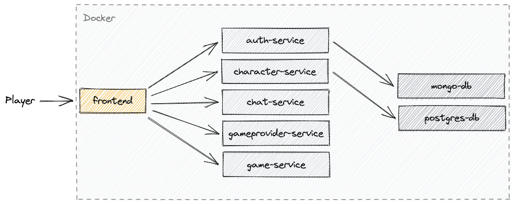

<h1 align="center">Maple Fighters</h1>
<p align="center">
  
  <br><i>A small online game similar to MapleStory</i><br>
</p>
<p align="center">
  <a href="http://maplefighters.io"><strong>maplefighters.io</strong></a>
  <br>
</p>

## About

Maple Fighters is an online multiplayer game inspired by MapleStory where you battle monsters with others in real-time.

Please **★ Star** if you like it. Made With :heart: For Open Source Community!

## Play Online

Maple Fighters is available at [maplefighters.io](http://maplefighters.io). This is a web game, no installation required. Supported in any web browser with internet connection. Small, optimized, and incredibly fast! 🚀

## Screenshots

| Lobby                             | The Dark Forest                             |
| --------------------------------- | ------------------------------------------- |
|  |  |

## Technology

**Game Engine**: Unity WebGL  
**Client**: C#, React.js (_C# is compiled to C++ and finally to WebAssembly_)  
**Server**: C#, Rust, Node.js  
**Database**: MongoDB, PostgreSQL  
**Reverse Proxy**: Nginx  
**Cloud**: DigitalOcean 

## Architecture



## Projects

| Name                                               | Language | Description                                    | Build Status                                                                                                                                                                                                                          |
| -------------------------------------------------- | -------- | ---------------------------------------------- | ------------------------------------------------------------------------------------------------------------------------------------------------------------------------------------------------------------------------------------- |
| [maple-fighters](./src/maple-fighters)             | C#       | Game code of the Maple Fighters.               | [](https://github.com/codingben/maple-fighters/actions/workflows/unity-build.yml)                                              |
| [frontend](./src/frontend)                         | React.js | Provides game files generated by Unity.        | [](https://github.com/codingben/maple-fighters/actions/workflows/frontend-build.yml)                                     |
| [auth-service](./src/auth-service)                 | C#       | Stores user data and verifies user.            | [](https://github.com/codingben/maple-fighters/actions/workflows/auth-service-build.yml)                         |
| [game-service](./src/game-service)                 | C#       | Creates game scenes, players and game objects. | [](https://github.com/codingben/maple-fighters/actions/workflows/game-service-build.yml)                         |
| [gameprovider-service](./src/gameprovider-service) | Rust     | Provides a list of game servers.               | [](https://github.com/codingben/maple-fighters/actions/workflows/gameprovider-service-build.yml) |
| [character-service](./src/character-service)       | Rust     | Stores the player's character data.            | [](https://github.com/codingben/maple-fighters/actions/workflows/character-service-build.yml)          |
| [chat-service](./src/chat-service)                 | Node.js  | Allows players to communicate with each other. | [](https://github.com/codingben/maple-fighters/actions/workflows/chat-service-build.yml)                         |

## Quickstart

### Docker

> 💡 Please make sure you have Docker installed.

Build and run docker images:

```bash
docker compose up
```

### Kubernetes

> 💡 Please make sure you have Kubernetes cluster.

1. Clone repository:

```bash
git clone https://github.com/codingben/maple-fighters.git
cd maple-fighters
```

2. Create Kubernetes resources:

```bash
kubectl apply -f ./release/kubernetes-manifests.yaml
```

3. Make sure you have all pods ready:

```bash
kubectl get pods
```

4. Use `EXTERNAL_IP` to access in a web browser:

```bash
kubectl get service frontend-external
```

## Contributing

Please read the [contributing guidelines](CONTRIBUTING.md).

## Artwork

The artwork is owned by Nexon Co., Ltd and will never be used commercially.

## License

[AGPL](https://choosealicense.com/licenses/agpl-3.0/)
