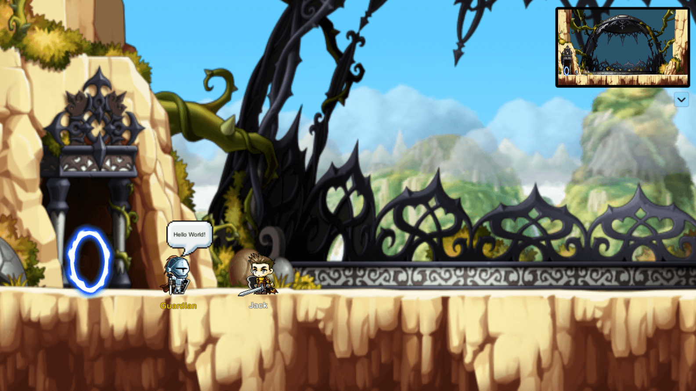
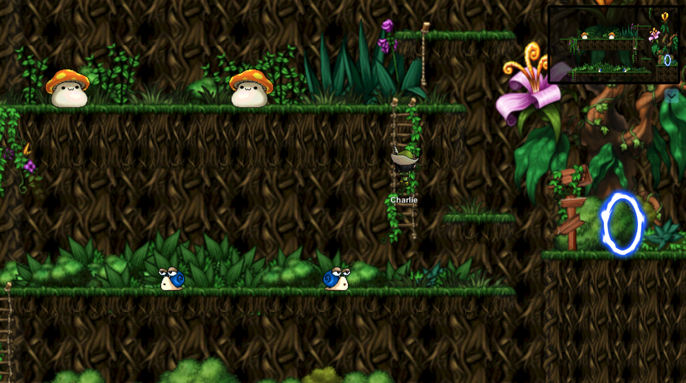

<h1 align="center">Maple Fighters</h1>
<p align="center">
  
  <br><i>A small online game similar to MapleStory</i><br>
</p>
<p align="center">
  <a href="http://maplefighters.io"><strong>maplefighters.io</strong></a>
  <br>
</p>

## About

[](https://github.com/benukhanov/maple-fighters/actions/workflows/unity-build.yml)

Maple Fighters is a multiplayer online game inspired by MapleStory. Players can choose a fighter to travel the world and fight monsters with other fighters.

Please **★ Star** this repository if you like it and find it useful. Made With ♥ For Open Source Community!

## Demo

Feel free to play on the web platform [here](https://ukben.dev/maple-fighters). Please note that it is currently offline version.

## Screenshots

| Lobby                             | The Dark Forest                             |
| --------------------------------- | ------------------------------------------- |
|  |  |

## Technology

**Game Engine**: Unity WebGL  
**Client**: C#, React.js (_C# is compiled to C++ and finally to WebAssembly_)  
**Server**: C#, Rust, Node.js  
**Database**: MongoDB, PostgreSQL  
**Reverse Proxy**: Nginx

## Microservices Architecture

| Service                                             | Language | Description                                             |
| --------------------------------------------------- | -------- | ------------------------------------------------------- |
| [auth-service](./src/auth-service)                  | C#       | Stores user data and verifies user.                     |
| [game-service](./src/game-service/Game.Application) | C#       | Creates a player in the game world to play with others. |
| [gameprovider-service](./src/gameprovider-service)  | Rust     | Provides a list of game servers.                        |
| [character-service](./src/character-service)        | Rust     | Creates and receives player character data.             |
| [chat-service](./src/chat-service)                  | Node.js  | Communication between players during the game.          |

## Folder Structure

```
├── docs
│   └── images
├── lib
│   ├── common
│   ├── interest-management
│   ├── interest-management-simulation
│   └── ui-manager
└── src
    ├── auth-service
    ├── character-service
    ├── chat-service
    ├── frontend
    ├── gameprovider-service
    ├── game-service
    └── maple-fighters
```

## Quickstart

### Docker

> 💡 You need to install Docker and Docker Compose locally.

Follow these instructions to start and stop locally:

1. To create containers:

```bash
docker-compose up
```

2. To stop and remove containers:

```bash
docker-compose down
```

You should be able to access it at `http://localhost`.

## Contributing

Feel free to contribute and make any changes to the game itself. Please open an issue to discuss the changes before sending the PR.

Please follow the [Conventional Commits](https://www.conventionalcommits.org/) specification.

## Artwork

The artwork is owned by Nexon Co., Ltd and will never be used commercially.

## License

[AGPL](https://choosealicense.com/licenses/agpl-3.0/)
